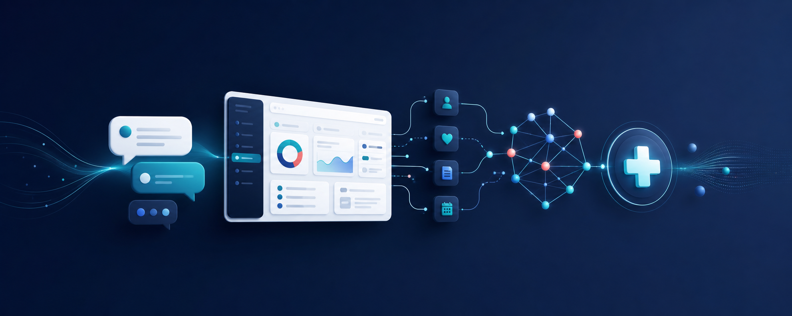
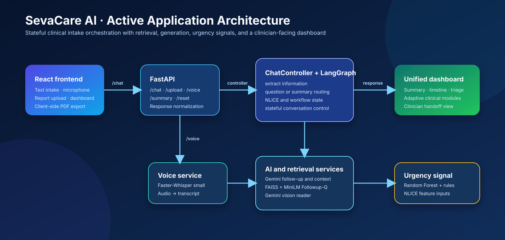
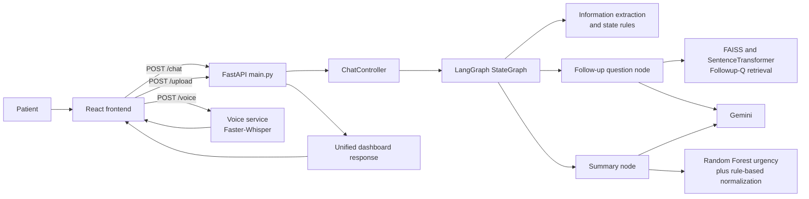

# SevaCare AI

> Production-style agentic clinical intake platform for collecting structured symptom history, generating clinician-facing handoffs, and surfacing triage signals for review.

[](https://www.python.org/) [](https://fastapi.tiangolo.com/) [](https://langchain-ai.github.io/langgraph/) [](https://ai.google.dev/) [](https://faiss.ai/) [](https://react.dev/) [](https://github.com/SYSTRAN/faster-whisper) [](https://scikit-learn.org/)



<p align="center"><sub>Conceptual product illustration · authentic dashboard captures are added only when taken from the running application.</sub></p>

## ✨ Project highlights

| | Why it matters |
| --- | --- |
| 🧭 **Controlled agent workflow** | LangGraph makes each turn inspectable: extract information first, then either ask the next focused question or complete the summary. |
| 🧠 **Retrieval-grounded follow-ups** | FAISS-retrieved examples inform question phrasing while deterministic state logic retains control over what is asked. |
| 🩺 **Clinician-oriented handoff** | Structured NLICE data, triage signals, timeline, adaptive modules, and a PDF export reduce transcript-reading overhead. |
| 🎙️ **Voice-to-intake path** | Faster-Whisper turns browser-recorded audio into editable text before it enters the standard chat workflow. |

## ▶️ Demo

1. Start the FastAPI backend and React frontend using the [local run guide](#installation-and-local-run).
2. Create a patient session, then describe a primary symptom by text or microphone.
3. Answer the focused follow-up questions until the intake completes.
4. Review the adaptive dashboard and export the report area as a PDF.

> A public hosted demo is not configured in this repository. The included application runs locally; see the [API overview](#api-overview) and [architecture diagram](docs/images/architecture.svg).

## Overview

SevaCare AI turns an unstructured symptom conversation into a structured clinical-intake record, a non-diagnostic summary, urgency signals, and an adaptive dashboard for clinician review.

| Clinical-intake challenge | SevaCare AI approach |
| --- | --- |
| A general chatbot can drift, repeat itself, or return prose that is difficult to hand off. | A stateful workflow tracks missing information and asks one focused follow-up at a time. |
| Free-text symptoms are hard to compare or summarize consistently. | The controller maintains an NLICE-oriented structure: Nature, Location, Intensity, Chronology, and Excitation. |
| LLM questions need context but should retain workflow control. | Deterministic routing selects the next information need; retrieval and Gemini help phrase the question. |
| Clinicians need an at-a-glance handoff, not a raw transcript. | The React dashboard derives a timeline, focused cards, triage indicators, recommendations, and a client-side PDF export. |

The active application path is **React → FastAPI → ChatController → LangGraph → agents/retrieval/model → unified dashboard response**. Earlier Streamlit and root-level React files remain in the repository as legacy or alternative interfaces.

## Key capabilities

| Capability | Implementation |
| --- | --- |
| **Agentic intake workflow** | `ChatController` maintains conversation state, extracts information, and routes each turn to a follow-up or summary node. |
| **LangGraph orchestration** | A `StateGraph` runs `extract_info_node`, then conditionally invokes `question_node` or `summary_node`. |
| **Retrieval-augmented follow-ups** | FAISS retrieves semantically similar Followup-Q examples using `all-MiniLM-L6-v2`; Gemini produces a context-aware question with deterministic fallbacks. |
| **Live clinical dashboard** | React renders patient information, clinical snapshot, completeness, triage, summary, timeline, specialty modules, and session history. |
| **Voice input** | Browser `MediaRecorder` uploads audio to `/voice`; Faster-Whisper transcribes it before the user submits it through normal chat. |
| **Prescription/report reading** | `/upload` passes uploaded bytes through the Gemini vision reader, which returns only visible text and marks uncertainty for confirmation. |
| **Urgency signal** | A joblib-loaded Random Forest consumes NLICE features; application rules also apply red-flag/score normalization. The included model is trained on synthetic data. |
| **SOAP-style handoff and PDF** | The summary agent produces a non-diagnostic SOAP-style report; the dashboard exports the report area with `html2canvas` and `jsPDF`. |

## Dashboard previews

No authentic dashboard screenshots are currently committed, so this README does not use generated UI mockups in their place. The active dashboard is implemented in [`frontend/src/`](frontend/src/); add captures from the running application to [`docs/images/`](docs/images/) when available.

| Suggested capture | Intended path |
| --- | --- |
| Dashboard overview | `docs/images/dashboard.png` |
| Intake conversation | `docs/images/conversation.png` |
| Completed clinical summary | `docs/images/summary.png` |

See the [asset inventory](docs/images/README.md) for the visual-asset policy and current files.

## System architecture





<details>
<summary><strong>Runtime boundaries</strong></summary>

| Layer | Responsibility | Primary files |
| --- | --- | --- |
| Frontend | Patient setup, chat, microphone capture, report upload, local history, dashboard and client-side PDF export | `frontend/src/App.js`, `AdaptiveDashboard.js`, `clinicalState.js` |
| API | CORS, request handling, voice/upload endpoints, response normalization, dashboard module selection | `main.py` |
| Orchestration | Conversation state, NLICE extraction, progression rules, graph routing, summary completion | `chat_controller.py` |
| Generation | Follow-up phrasing, clinical context, report reading, SOAP-style summary | `agents/` and `services/gemini_vision_service.py` |
| Retrieval | FAISS indexes and SentenceTransformer embeddings for Followup-Q examples; separate SymCAT retrieval utilities also exist | `followup_retriever.py`, `rag/` |
| ML | Random Forest training/inference artifacts for NLICE-based urgency classification | `ml/` |
</details>

## Agent architecture

The table separates components wired into the active graph from reusable agents present elsewhere in the repository.

| Component | Status | Input → output | Responsibility |
| --- | --- | --- | --- |
| `extract_info_node` | Active | Patient turn + state → updated NLICE, symptoms, workflow state | Parses and validates turn-level clinical information. |
| `followup_question_agent` | Active through `question_node` | Complaint, missing NLICE field, history, retrieved examples → one question | Produces a targeted question; falls back safely when retrieval or Gemini fails. |
| `clinical_exploration_agent` | Active when exploration is needed | Complaint, current state, history, retrieved examples → one exploratory question | Covers clinically relevant context beyond the core NLICE fields. |
| `summary_node` / `summary_agent` | Active | Completed state → SOAP-style non-diagnostic summary and recommendations | Creates the clinician handoff after intake completion. |
| `urgency_classifier_agent` | Used by summary flow | NLICE features → urgency label and reason | Runs the saved Random Forest; high intensity has a protective override. |
| `clinical_context_agent` | Used by summary flow | Complaint, answers, vision text, safety flags → context | Generates cautious, non-diagnostic clinical context for review. |
| `vision_reader_agent` | Available through file handling | Image bytes → visible-text result + confirmation flag | Uses Gemini vision to read prescriptions/reports without guessing unreadable content. |
| `complaint_agent` | Implemented, not wired into active graph | Complaint text → organized complaint | Formats the chief complaint without diagnosing. |
| `patient_question_agent` | Implemented, legacy path | Complaint + demographics → 3–5 questions | Uses the separate SymCAT retrieval utility. |
| `clinical_synthesis_agent` | Implemented, not wired into active graph | Intake state → normalized NLICE JSON | Alternative Gemini-based synthesis path. |
| `safety_agent` | Implemented, not wired into active graph | Answers → safety flags | Flags reported allergies, side effects, concurrent medicines, and chronic conditions. |

## End-to-end workflow

1. The patient enters demographics and describes a primary symptom by text or microphone.
2. The React client sends text to `POST /chat`; voice is first transcribed by `POST /voice`.
3. `extract_info_node` updates the clinical state and checks workflow/NLICE completeness.
4. LangGraph routes the turn to `question_node` for the next focused question, or `summary_node` when intake is complete.
5. The question path retrieves comparable Followup-Q examples from FAISS and asks Gemini for a patient-friendly question, with a deterministic fallback.
6. The summary path produces clinical context, an urgency signal, a SOAP-style summary, and recommendations.
7. FastAPI normalizes the controller state into one response; `clinicalState.js` derives dashboard fields, timeline, triage display, and active modules.
8. The dashboard provides the clinician-facing view and can export the report area as a PDF in the browser.

## Technology stack

| Area | Technologies in this repository | Use |
| --- | --- | --- |
| Frontend | React 19, Tailwind CSS, Framer Motion, Lucide, `html2canvas`, `jsPDF` | Intake UI, adaptive dashboard, interaction polish, PDF export |
| Backend | Python, FastAPI, Uvicorn, Pydantic | HTTP API and response normalization |
| Orchestration | LangGraph, LangChain Core | Stateful graph routing and message/state handling |
| LLM & vision | Google GenAI / Gemini (`gemini-2.5-flash`, `gemini-1.5-flash`) | Follow-up phrasing, clinical context, image reading, optional synthesis |
| Retrieval | FAISS, SentenceTransformers (`all-MiniLM-L6-v2`), Followup-Q artifacts | Semantic retrieval of follow-up examples |
| Speech | Faster-Whisper (`small`, CPU `int8`) | Audio transcription with optional `en`, `hi`, and `bn` hints |
| ML | scikit-learn, joblib, pandas | Random Forest urgency model and training utility |
| Legacy UI | Streamlit | Alternative/earlier intake interfaces |
| Deployment | — | No deployment configuration is currently included. |

## Evaluation framework

**Quick links:** [Evaluation guide](evaluation/README.md) · [Latest committed evaluation report](evaluation/results/evaluation_report.md)

The [`evaluation/`](evaluation/) suite evaluates production-path functions where dependencies and required services are available. It records a **skipped** result rather than fabricating a metric when a runtime dependency, model artifact, or API is unavailable.

| Evaluation | What it exercises | Script |
| --- | --- | --- |
| NLICE extraction | Production extraction function and labeled NLICE fixtures | `evaluation/evaluate_nlice.py` |
| Retrieval | Follow-up retriever against labeled retrieval cases | `evaluation/evaluate_retrieval.py` |
| Summary coverage | Summary agent output against expected clinical facts | `evaluation/evaluate_summary.py` |
| OCR | OCR/vision path when runtime/API dependencies are available | `evaluation/evaluate_ocr.py` |
| Urgency | Urgency classifier against fixture cases | `evaluation/evaluate_urgency.py` |
| Latency | Real controller-path latency when available | `evaluation/evaluate_latency.py` |
| Conversation completion | `ChatController.handle_text` completion behavior | `evaluation/evaluate_conversation.py` |
| Token metadata | Controller token metadata when exposed | `evaluation/evaluate_tokens.py` |

```bash
python evaluation/evaluate_nlice.py
python evaluation/evaluate_retrieval.py
python evaluation/evaluate_summary.py
python evaluation/evaluate_urgency.py
python evaluation/evaluate_ocr.py
python evaluation/evaluate_conversation.py
python evaluation/evaluate_latency.py
python evaluation/evaluate_tokens.py
python evaluation/generate_report.py
```

Generated output is written to `evaluation/results/evaluation_report.md`. No performance figures are claimed here because results depend on the locally available runtime and configured services.

## Repository structure

```text
agentic_healthcare_ai/
├── agents/                    # Gemini, safety, synthesis, summary, and urgency components
├── data/                      # Followup-Q and SymCAT source/index artifacts
├── evaluation/                # Fixtures, evaluators, and generated reports
├── frontend/                  # Active React dashboard application
│   ├── src/
│   │   ├── App.js             # Intake, chat, voice, upload, PDF export
│   │   ├── AdaptiveDashboard.js
│   │   ├── DashboardComponents.js
│   │   ├── ClinicalModules.js
│   │   └── clinicalState.js
│   └── package.json
├── ml/                        # Random Forest training script and saved artifacts
├── rag/                       # SymCAT document/index/retrieval utilities
├── services/                  # Gemini vision service
├── chat_controller.py         # ClinicalState, LangGraph workflow, controller
├── followup_retriever.py      # Followup-Q FAISS retrieval
├── main.py                    # FastAPI entry point
├── voice_service.py           # Faster-Whisper transcription
├── app_streamlit.py           # Legacy/alternative Streamlit UI
├── requirements.txt
└── SEVACARE_ARCHITECTURE.md   # Detailed implementation architecture
```

## Installation and local run

### Prerequisites

- Python 3.10+
- Node.js 18+ and npm
- A Gemini API key
- Local model/index dependencies used by the active path: Faster-Whisper, FAISS, SentenceTransformers, and NumPy. These imports exist in the code but are not all listed in the current `requirements.txt`.

### 1. Create a Python environment

```bash
git clone https://github.com/Deborina-Barman/agentic-healthcare-ai.git
cd agentic-healthcare-ai

python -m venv .venv
# Windows PowerShell
.\.venv\Scripts\Activate.ps1
# macOS/Linux
# source .venv/bin/activate

pip install -r requirements.txt
pip install faster-whisper faiss-cpu sentence-transformers numpy
```

### 2. Configure environment variables

Create `.env` in the repository root:

```env
GEMINI_API_KEY=your_gemini_api_key
```

### 3. Start the API

```bash
uvicorn main:app --reload --host 127.0.0.1 --port 8000
```

The API is then available at `http://127.0.0.1:8000`.

### 4. Start the frontend

```bash
cd frontend
npm install
npm start
```

The React app is configured to call the local FastAPI server at `http://127.0.0.1:8000`.

<details>
<summary><strong>Alternative interface</strong></summary>

The repository also includes a Streamlit interface:

```bash
streamlit run app_streamlit.py
```

It is not the active React + FastAPI application path described above.
</details>

## API overview

| Endpoint | Purpose | Request | Response |
| --- | --- | --- | --- |
| `GET /health` | Health check | — | `{ "status": "ok" }` |
| `POST /chat` | Process one text intake turn | JSON: `user_input`, optional `session_id` | Unified controller/dashboard response |
| `POST /upload` | Process an uploaded report/prescription | Multipart: `file` | Unified controller/dashboard response |
| `POST /voice` | Transcribe browser audio | Multipart: `audio`, optional `language` | Status and transcript; it does not submit the text to `/chat` automatically |
| `GET /summary` | Generate the final summary from current controller state | — | Unified response with summary |
| `POST /reset` | Replace the in-memory controller with a fresh one | — | Reset status message |

> `GET /summary` is deliberately documented as `GET`: that is the method implemented in `main.py`.

## Design decisions

| Decision | Rationale in this codebase |
| --- | --- |
| **LangGraph for orchestration** | It makes turn routing explicit: extraction always runs first, then the graph decides between a question and a summary. |
| **Gemini for language and vision tasks** | Gemini is used where flexible natural-language phrasing, clinical context generation, and prescription-image reading are valuable; prompts enforce non-diagnostic constraints. |
| **FAISS retrieval for follow-ups** | Similar clinician-authored examples ground follow-up phrasing without handing full control of workflow order to the LLM. |
| **NLICE as structured intake state** | The representation gives the controller an inspectable checklist for symptom characterization and supports downstream summarization/classification. |
| **ML urgency classifier plus rules** | The Random Forest supplies a repeatable signal from NLICE features; explicit rules add protective red-flag handling. It is not clinically validated. |
| **Adaptive dashboard** | Category-aware modules turn the state into a concise handoff instead of requiring clinicians to read a conversational transcript. |

## Roadmap

- Add per-session controller storage; the current FastAPI implementation uses one global in-memory controller.
- Align declared Python dependencies and remove hard-coded local paths from retrieval tooling.
- Consolidate overlapping triage/category logic across controller, API, and frontend.
- Align the voice-language UI with the backend’s explicit language hints.
- Expand automated smoke/integration tests for chat, voice, retrieval, summary, and dashboard state synchronization.
- Add secure persistence, authentication, audit events, consent/PHI controls, and clinician-reviewed validation before considering real-world use.

## Disclaimer

**Educational and research use only.** SevaCare AI is not a medical device, does not diagnose disease or prescribe treatment, and is not clinically validated. It does not replace professional medical judgment, emergency services, or a qualified healthcare professional.

---

For detailed implementation notes and known limitations, see [SEVACARE_ARCHITECTURE.md](SEVACARE_ARCHITECTURE.md) and the [evaluation documentation](evaluation/README.md).
