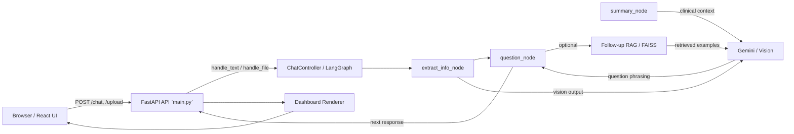
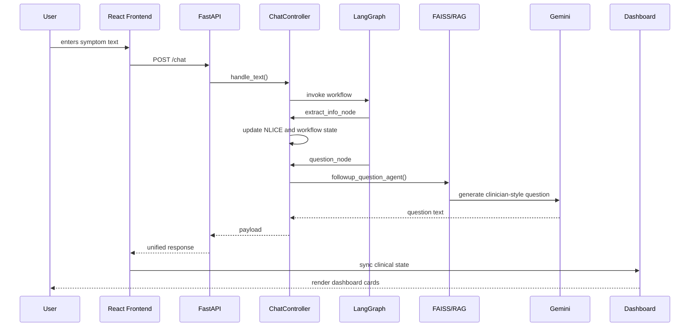
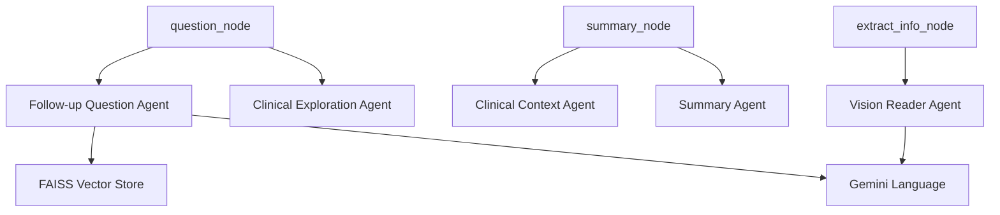
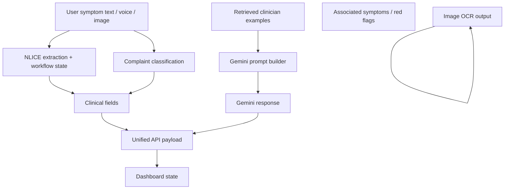

# SevaCare AI System Architecture

## Overview

SevaCare AI is a clinician-oriented clinical intake and triage system. It combines a React dashboard, FastAPI backend, LangGraph workflow orchestration, deterministic clinical state management, retrieval-augmented follow-up questioning, and Gemini language and vision integration.

The active end-to-end flow is:

User → Frontend → FastAPI → ChatController → LangGraph Controller → Agents → RAG/FAISS → Gemini → Dashboard

## 1. End-to-End Flow

1. Patient begins a session in the React UI (`frontend/src/App.js`).
2. The user submits symptom text, a photo upload, or voice input.
3. React sends input to `FastAPI` in `main.py`.
4. `FastAPI` normalizes request data and calls `ChatController.handle_text()` or `ChatController.handle_file()`.
5. `ChatController` stores the user message in state and invokes the compiled `LangGraph` workflow.
6. LangGraph runs `extract_info_node`, then conditionally routes to either `question_node` or `summary_node`.
7. `extract_info_node` updates rule-based NLICE fields, detects fever patterns, extracts symptoms, updates workflow context, and optionally uses Gemini fallback for missing values.
8. `question_node` decides the next clinical question using deterministic clinical rules, workflow-specific question selection, and a retrieval-augmented question generator.
9. If needed, the follow-up question agent loads examples from a FAISS vector store and calls Gemini to rephrase the question.
10. For image uploads, `vision_reader_agent` sends the image to Gemini Vision and stores OCR output in state.
11. When the intake is complete, `summary_node` generates urgency, clinical context, and a normalized summary using Gemini-backed agents plus rule-based checks.
12. `FastAPI` returns a normalized response payload.
13. The React dashboard merges backend payload via `clinicalState.js` and renders the adaptive clinician dashboard.

## 2. Component Explanations

### `main.py`

Purpose: FastAPI backend bridge between the React dashboard and the clinical controller.

Key responsibilities:
- Expose REST endpoints: `/chat`, `/upload`, `/voice`, `/summary`, `/reset`, `/health`.
- Normalize response payload shapes for the dashboard.
- Apply additional rule-based triage scoring and dashboard category selection.
- Keep a single `ChatController` instance guarded by `RLock`.

Important functions:
- `_normalize_analysis()`: computes urgency and reason from temperature and symptom text.
- `_classify_clinical_category()`: maps symptom text to categories like `cardiac`, `respiratory`, `infectious`, `neurology`, and `general`.
- `_select_active_modules()`: chooses dashboard cards based on clinical category and active symptoms.
- `_unified_response()`: returns the JSON contract the frontend expects.

### LangGraph workflow

The workflow is implemented in `chat_controller.py` using `StateGraph`.

Nodes:
- `extract_info_node`: intake extraction and state update.
- `question_node`: next-question selection.
- `summary_node`: final summary and clinical context generation.

Flow control:
- Entry point: `extract_info_node`.
- Conditional transition via `should_continue(state)`: either `question_node` or `summary_node`.
- Both `question_node` and `summary_node` transition to `END`.

Because LangGraph only orchestrates deterministic nodes, the controller keeps clinical flow predictable and the LLM is used only for phrasing.

### NLICE extraction

NLICE stands for:
- `nature`
- `location`
- `intensity`
- `chronology`
- `excitation`

Extraction is primarily rule-based in `extract_info_node()`:
- `intensity`: extracts numeric pain scale and explicit ratings.
- `location`: looks for body part keywords like `chest`, `head`, `stomach`, `back`, `leg`, `arm`, `throat`.
- `chronology`: parses durations like `2 hours`, `3 days`, and simple time expressions.
- `nature`: assigns `fever` or pain quality words like `sharp`, `burning`, `dull`, `throbbing`, `stabbing`, and `pressure`.
- `excitation`: detects whether pain gets `better` or `worse` with an activity or trigger.

The system also updates concept memory, associated symptom lists, medication mentions, red-flag screening status, and workflow selection.

When three or more NLICE fields remain missing and rule-based extraction is insufficient, `extract_info_node` may use Gemini fallback extraction to fill missing fields in a controlled JSON format.

### Fever workflow

The fever workflow is defined in `clinical_workflows.py`.

Key elements:
- `required_fields`: duration, temperature maximum, respiratory/systemic symptoms, medication taken, medication response, hydration, vomiting/diarrhea, danger flags, exposure.
- `priority_order`: concrete order used when fever is detected.
- `conditional_priority`: escalation rules if temperature exceeds clinical thresholds such as `>103 F` or `>=105 F`.
- `field_questions`: deterministic phrasing for fever-specific follow-up questions.
- `red_flags`: fever-related danger symptoms such as shortness of breath, confusion, stiff neck, severe weakness, chest pain, fainting, rash, dehydration.

In `chat_controller.py`, fever is detected with `detect_workflow()` and then routed to fever-specific workflow behavior. Fever-specific clinical fields are tracked separately from general NLICE and used to drive the next questions.

### Symptom workflows

Symptom workflows are also declared in `clinical_workflows.py` for complaint types such as `cough`, `headache`, `abdominal pain`, `chest pain`, `GI`, and more.

Each workflow specifies:
- `display_name`
- `required_fields`
- `priority_order`
- `conditional_priority`
- `red_flags`
- `field_questions`
- `nlice_fields_to_keep`
- `structured_fields`

`ChatController` uses these workflows to select the next most important question when the intake matches a known complaint type.

### RAG retrieval

SevaCare uses retrieval-augmented generation primarily for follow-up question generation.

Active retrieval path:
- `followup_retriever.py`: loads a cached FAISS index and pickled records.
- `agents/followup_question_agent.py`: builds a prompt with retrieved examples, current NLICE state, prior questions, and conversation context.
- `chat_controller.py` `question_node()`: calls `followup_question_agent()` when the next question target is an NLICE field or exploration target.

The older SymCAT retrieval path is implemented in `agents/question_agent.py` and `rag/retrieve_context.py`, but it is not part of the current LangGraph active question flow.

### FAISS vector store

The FAISS vector store is built in `build_followup_index.py` and loaded in `followup_retriever.py`.

Properties:
- Uses `faiss-cpu` for efficient approximate nearest-neighbor search.
- Embeddings are generated with `sentence_transformers` model `all-MiniLM-L6-v2`.
- Stored vectors live in `data/followup_q/followup_index.faiss`.
- Source records are stored in `data/followup_q/followup_records.pkl`.

The retrieval pipeline is lazy-loaded and cached globally to keep repeated follow-up agent calls fast.

### Gemini integration

Gemini is used for:
- fallback NLICE extraction when many fields are missing.
- follow-up question phrasing in `agents/followup_question_agent.py` and `agents/clinical_exploration_agent.py`.
- generating clinical context in `agents/clinical_context_agent.py`.
- summary generation in `agents/summary_agent.py`.
- image OCR via `services/gemini_vision_service.py`.

Gemini is intentionally not allowed to make clinical flow decisions. The system only uses Gemini for:
- question phrasing
- natural language summarization
- vision reading

This separation keeps operational decisions deterministic and clinical workflow safe.

### OCR pipeline

The OCR path lives in:
- `main.py` `/upload`
- `chat_controller.py` `handle_file()`
- `agents/reader_agent.py`
- `services/gemini_vision_service.py`

Flow:
1. React sends image bytes to `/upload`.
2. `main.py` reads file bytes and forwards them to `ChatController.handle_file()`.
3. `ChatController.handle_file()` calls `vision_reader_agent(image_bytes)`.
4. `vision_reader_agent()` calls `read_prescription_with_gemini(image_bytes)`.
5. `gemini_vision_service.py` sends the image to Gemini Vision as `image/jpeg`.
6. The returned `vision_output` is stored in controller state and used during clinical context generation.

This pipeline is currently configured for prescription/medical report reading but can be extended to other clinical images.

### Dashboard state management

The dashboard state is managed by the frontend in `frontend/src/clinicalState.js`.

Responsibilities:
- maintain patient metadata and visit history.
- merge backend payload into frontend state.
- detect symptoms and negatives from returned text.
- parse temperature, severity, and duration.
- classify clinical category and select active cards.
- update timeline and summary.
- store recent sessions in `localStorage`.

The React UI uses this derived state to render an adaptive `AdaptiveClinicalDashboard` with cards such as:
- `GeneralSnapshotCard`
- `TriageAlertsCard`
- `AIClinicalSummaryCard`
- `FeverClinicalCard`
- `CardiacRiskCard`
- `RespiratoryRiskCard`
- `GastrointestinalCard`
- `NeurologyRiskCard`
- `PregnancyRiskCard`
- `MedicationCard`
- `RecommendedNextStepsCard`

The frontend also manages voice capture, file upload, and PDF export.

## 3. Diagrams

### High-level architecture diagram

### Sequence diagram

### Agent interaction diagram

### Data flow diagram

## 4. Deterministic Workflow and Guardrails

### Why workflow control is deterministic

- `chat_controller.py` owns the decision logic for when the system asks another question versus when it finishes intake.
- `LangGraph` orchestrates explicit nodes and conditional transitions rather than asking the LLM what to do.
- The controller tracks `workflow_key`, `questions`, `exploration_questions`, `conversation_complete`, and missing fields.
- Known workflows in `clinical_workflows.py` impose a structured priority order for fever, cough, headache, and other symptom types.

This means the system does not rely on Gemini to decide the clinical path; it only relies on Gemini to phrase the next question or summarize context.

### Why the LLM is not allowed to control clinical flow

- Gemini is used for phrasing, not routing.
- The system avoids freeform clinical directives from the LLM.
- `followup_question_agent.py` and `clinical_exploration_agent.py` return a single follow-up question, not a decision about what to ask next.
- Clinical priority and completion rules remain in hard-coded state logic.

This split reduces risk by preventing the LLM from setting diagnosis priorities or skipping required workflow questions.

### Where hallucinations can happen

Primary hallucination risk areas:
- Gemini summarization in `summary_agent.py`.
- Gemini clinical context generation in `clinical_context_agent.py`.
- Gemini follow-up phrasing in `followup_question_agent.py` and `clinical_exploration_agent.py`.
- Gemini Vision OCR output in `services/gemini_vision_service.py`.
- Gemini fallback NLICE extraction in `extract_info_node()`.

Secondary risk sources:
- Rule-based symptom detection misclassifying negated terms.
- Clinical field inference from partial patient text.
- Dashboard interpretation of backend strings.

### How guardrails reduce hallucinations

- Use Gemini only for phrasing, summarization, and OCR, not for clinical control.
- Enforce deterministic question selection in `question_node()`.
- Validate and clean extracted fields with `_validate_clinical_state()`.
- Apply semantic redundancy checks before asking a question again.
- Use retrieval examples to ground Gemini phrasing in clinician-authored context.
- Add rule-based red-flag detection and fallback static questions.
- Normalize backend output into explicit fields for the dashboard.

## 5. Interview Explanations

### 2-minute version

SevaCare AI is a clinician-centered triage assistant that collects structured symptom data through a conversational intake workflow. A React dashboard sends patient text to a FastAPI backend. The backend uses `ChatController` and a LangGraph workflow to extract symptom details into NLICE fields, choose the next clinical question, and generate a normalized response. Follow-up question wording is enhanced with retrieval from a FAISS vector store and Gemini phrasing, while the actual clinical flow remains deterministic and rule-governed. The result is a dashboard-ready summary and urgency assessment that is safer than a freeform chatbot.

### 5-minute version

SevaCare AI blends deterministic clinical workflow scaffolding with modern LLM and retrieval tools. The patient-facing app is a React dashboard that sends symptom text, images, or voice transcripts to a FastAPI backend. The backend uses `ChatController.handle_text()` to append input to history, then runs a LangGraph workflow comprised of an extraction node, a question selection node, and a summary node.

Extraction captures NLICE fields and symptom patterns with rule-based parsing plus optional Gemini fallback. Question selection is guided by complaint-specific workflows and follows a strict priority order. If the next question target is best phrased with natural language, the system uses a follow-up question agent that retrieves clinician-authored examples from a FAISS index and asks Gemini to phrase one clinician-style question. The LLM is never trusted to decide the clinical path; it only improves wording.

After intake finishes, the summary node assembles urgency, clinical context, and a normalized summary. The frontend receives a clean payload and uses `clinicalState.js` to render an adaptive dashboard with cards for fever, respiratory risk, cardiac risk, and more.

The main design principle is separation of control from quality: deterministic workflow logic controls the sequence, retrieval and Gemini improve phrasing, and the dashboard provides clinician-readable output.

### 10-minute version

SevaCare AI is designed as a hybrid clinical intake engine where deterministic workflow control is intentionally separated from generative language capabilities.

At the top-level, the React dashboard in `frontend/src/App.js` is responsible for user entry, file upload, voice capture, local visit history, and rendering active clinical cards. It sends symptom text to a FastAPI backend in `main.py`, which normalizes the payload and forwards it to the central `ChatController`.

`ChatController` uses a LangGraph compiled state machine with three primary nodes:
- `extract_info_node`: parses the latest patient input, updates NLICE slots, detects fever and red flags, stores concept memory, and extracts structured clinical fields.
- `question_node`: decides whether the conversation should continue and which question to ask next. It enforces loop limits, can choose workflow-specific follow-ups, and uses retrieval-augmented question generation when useful.
- `summary_node`: finalizes intake with urgency classification, clinical context generation, summary normalization, and recommendations.

NLICE extraction is the backbone of symptom structure. The system captures nature, location, intensity, chronology, and excitation using regex patterns and keyword lists. When patient text lacks enough explicit structure, the system may optionally call Gemini to extract missing NLICE values in a controlled JSON format.

Fever and other complaint workflows are defined in `clinical_workflows.py`. Each workflow includes required fields, priority order, red flags, and question templates. For example, the fever workflow prioritizes temperature maximum, danger flag screening, medication response, hydration, and exposure. This workflow layer keeps the history-taking sequence clinically coherent.

The follow-up question agent is a retrieval-augmented component. It uses `followup_retriever.py` to perform semantic search against a pre-built FAISS index of clinician-authored examples. The retrieval result is combined with the current complaint, missing NLICE target, prior questions, and conversation context to build a Gemini prompt. Gemini then returns one clinician-style question. The controller checks this question against previous questions and concept memory to avoid repetition.

Gemini is also used for clinical context generation and summary phrasing, but never for controlling which clinical field to collect next. This is the key safety guardrail: LLMs contribute quality, not workflow decisions.

The OCR pipeline extends the system to image inputs. An image uploaded through `/upload` is sent to Gemini Vision via `services/gemini_vision_service.py` and the resulting text is stored in state. This vision output is then available to downstream agents for richer clinical context.

Finally, `main.py` normalizes the controller payload into a dashboard-friendly shape. It also applies rule-based urgency scoring and selects active dashboard modules based on category detection. The frontend merges this normalized payload, updates patient state, and displays adaptive clinical cards. This means the UI can present a clinician-like summary, triage alert, and safety checklist without exposing raw LLM internals.

## 6. Tradeoffs and Future Improvements

### Rule-based vs LLM-based

- Rule-based strengths:
  - deterministic behavior
  - predictable clinical sequence
  - easier safety auditing
  - simple red-flag handling
- Rule-based limitations:
  - brittle language coverage
  - limited nuance
  - harder to scale to many complaint types

- LLM-based strengths:
  - fluent, clinician-style phrasing
  - broader natural language understanding
  - useful fallback for ambiguous text
- LLM-based limitations:
  - hallucination risk
  - can drift from clinical workflow
  - requires guardrails and retrieval grounding

SevaCare uses rules for control and LLMs for quality.

### RAG benefits

- grounds Gemini phrasing in clinician-authored examples
- reduces generic chatbot tone
- keeps questions relevant to the current complaint
- enables fast local search with FAISS

### Limitations of the current system

- single-session controller state in `main.py`, not per-session storage
- frontend and backend duplicate some clinical logic
- LLM is still a single point for question phrasing and summarization
- OCR output quality depends entirely on Gemini Vision
- workflow selection may still misclassify complex presentations
- no explicit user-facing confidence or provenance labels in the dashboard

### Future improvements

- add true per-session state management with session IDs
- move dashboard logic into backend for a single source of truth
- expand workflow definitions and complaint-specific state models
- add provenance metadata for Gemini outputs
- implement explicit LLM output validation and fact-checking
- support multi-turn visual input and structured image findings
- add a bounded clinical knowledge retrieval layer for diagnosis-safe context

## Glossary

- NLICE: nature, location, intensity, chronology, excitation.
- RAG: retrieval-augmented generation.
- FAISS: Facebook AI Similarity Search.
- LangGraph: workflow orchestration library used in `chat_controller.py`.
- Gemini: Google GenAI models used for language and vision.
- OCR: optical character recognition pipeline via Gemini Vision.
- Dashboard state management: frontend merging of backend payload into adaptive clinical cards.
